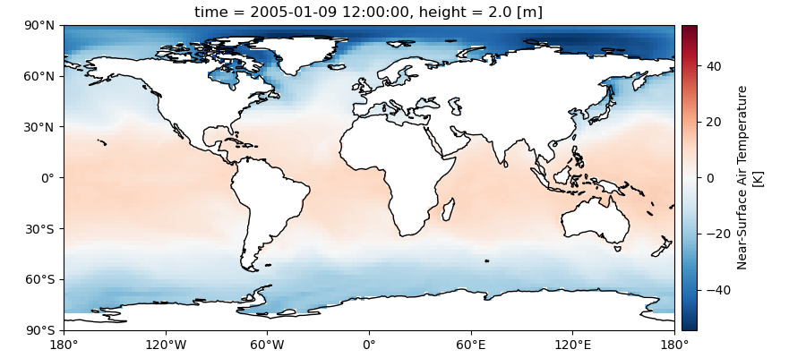
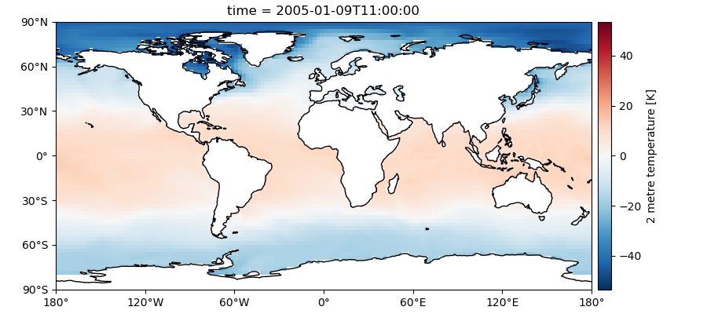

# Model Learning: disdinguish models and observations based on daily output

**Model learning** combines the terms _climate model_ and _machine learning_ providing a framework to disdinguish models and observations based on output maps. It draws on the concepts of model performance ("how different is a model from the observations?") and model independence ("how different are models from each other?"). The repository contains different machine learning classifiers to disdinguish models from observations (binary classification) and to models from each other (multi-class classification). 

Compared to traditional approaches considerably shorter time periods are used as basis for the classification and extensive out-of-sample testing is performed. One boiled down question we ask is: **is this gridded map of daily temperature more likely to come from a model or from an observation?** 

Example sample 1 | Example sample 2
:-|:-
 | 

Table of contents 
-----------------   

- [Model Learning: disdinguish models and observations based on daily output](#model-learning-disdinguish-models-and-observations-based-on-daily-output)
  - [Table of contents](#table-of-contents)
  - [Overview](#overview)
    - [Terminology](#terminology)
    - [Structure of the repository](#structure-of-the-repository)
    - [Input data](#input-data)
  - [Example cases for `binary_logistic_regression`](#example-cases-for-binary_logistic_regression)
    - [Using pre-trained classifiers](#using-pre-trained-classifiers)
    - [Training a new classifier](#training-a-new-classifier)
    - [Regularization](#regularization)
  - [About the included land sea mask](#about-the-included-land-sea-mask)

Overview
--------

The scientific and methodological details are discussed in the paper: Brunner and Sippel (in review): Identifying climate models based on their daily output using machine learning. _Env. Data Sci._ Preprint: https://doi.org/10.31223/X53M0J

You are free to reuse this code for your own research following the conditions outlinend in the [license](./LICENSE). If you do so, please cite the paper above. For any questions feel free to contact me via [email](mailto:l.brunner@univie.ac.at). 

### Terminology
To avoid confusion between different terms this document uses the following conventions:
- **model** refers to physical climate models which provide daily output maps used as input for the machine learning classifiers
- **classifier** refers to the machine learning algorithm used to distinguish models from observations

### Structure of the repository

The repository contains the following folders:
- `data`: contains the training and test data as well as several pre-trained classifiers
- `plots`: is the default plot folder for the scripts and contains some examples
- `scripts`: contains the scripts used to train and test the classifiers
  - `core`: contains the core functions used by the scripts
  - `binary_logistic_regression`: **This is the recommended starting point** as it represents to simplest and most extensively documented case. It contains the scripts used to train and test the binary case (models versus observations) based on logistic regression classifiers.
  - `binary_cnn`: contains scripts based on convolutional neural network classifiers.
  - `multi_class_cnn`: contains scripts based on convolutional neural network classifiers for the multi-class case (recognise each dataset by its name).

### Input data

The default input data format are daily maps of 2-m surface air temperature on a 2.5x2.5 degree latitude-longitude grid but other frequencies, variables, or resolutions are inprinciple also possible. We use two different pre-processing steps:
- absolute fields
- deseasonalised fields: mean seasonal cycle removed from each day of the year, grid cell and dataset separately (see Brunner and Sippel (in review) for details)

Two on-the-fly pre-processing steps are also available:
- land masked (lm) fields
- fields with daily global mean removed (gm)

Example cases for `binary_logistic_regression`
----------------------------------------------

---
**NOTE:** the training data will not be made available but all original datasets are publicly available and trained classifiers are provided. See Brunner and Sippel (in review) for details on the datasets used and their sources.

**NOTE:** the testdata are not yet available. They will be linked here from a Zonodo repository once the paper is published. 

---

The folder contains three example workflows. For all cases ocean temperature grid cells (land masked - lm) are used as features with the mean over all features subtracted (daily global mean removed - gm). Trained classifiers are saved in the `./trained_classifiers` folder. 

1.  Training and testing on all datasets but in different time periods (temporally out-of-sample). 
    - `./binary_logreg_fit.ipynb`
    - `./binary_logreg_predict.ipynb`
2.  Training only on datasets not used for testing (dataset out-of-sample) iteratively. Note that this leads to a different classifier for each group of test datasets. See Brunner and Sippel (in review) for details on the grouping of the datasets. 
    - `./binary_logreg_dataset_outsample.py`
    - `./binary_logreg_dataset_outsample_plot.ipynb`
3. Testing the trained classifiers on an arbitrary dataset. This is mainly intended for initial testing and playing around with new datasets.   
    - `./binary_logreg_predict_single.ipynb`

### Using pre-trained classifiers

The repository contains pre-trained classifiers which can be used for testing arbitrary new datasets and/or variables. For the binary case (models versus observations) and logistic regression these are:

- `./trained_classifiers/binary_logreg_absolute_historical_lm_gm.sav`: a logistic regression classifier trained on all available datasets (see 1. above). 
- `./trained_classifiers/outsample/binary_logreg_absolute_historical_lm_gm_*.sav`: logistic regression classifiers trained on all datasetes except the one indicated in the filename (see 2. above).

You can load any dataset and use the `preprocess` function to prepare it for classification. The dataset should have the following properties:
- 3D array with dimensions (time, lat, lon)
- the variable should be daily temperature (although related variables such as maximum temperature also work)
- the spatial resolution should be 2.5x2.5 degrees (to regrid from another resolution use, e.g., `cdo remapbil,data/land_mask.nc input.nc output.nc`)

For more information follow the examples given in `./binary_logreg_predict_single.ipynb`. 

### Training a new classifier

For an example on how to train a new classifier follow the steps in `./binary_logreg_fit.ipynb`. You could try, e.g., to set the `land_mask` to `False` to see how the classification performance changes when using all grid cells. 

### Regularization

If you want to speed up the training process you can set the `C` parameter in the `LogisticRegression` to a fixed value instead of optimising it using cross-validation. For the global case an sensible order of magnitude is `1e-2` (the lm-gm case uses `0.002`). 

## About the included land sea mask

The land sea mask aims to fulfill two requirements:
- mask out ocean grid cells
- mask out grid cells not available in one of the datasets (the only dataset used which does not have all grid cells available is IOSST). 

Therefore, it combines two masks, one based on the Python `regionmask` package (drawing on natural earth polygons) and one based on missing values in the IOSST dataset (see `./create_land_mask.ipynb`).